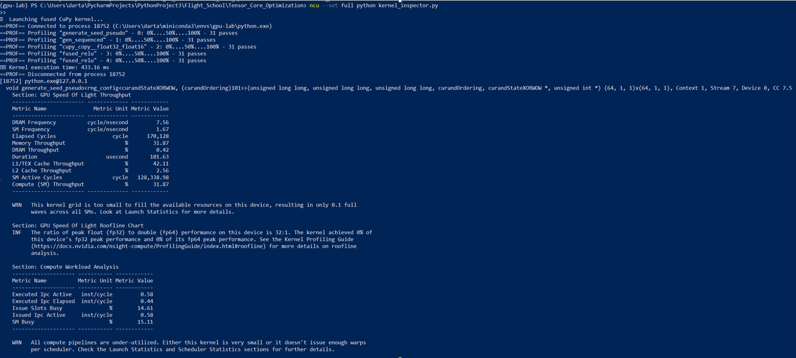
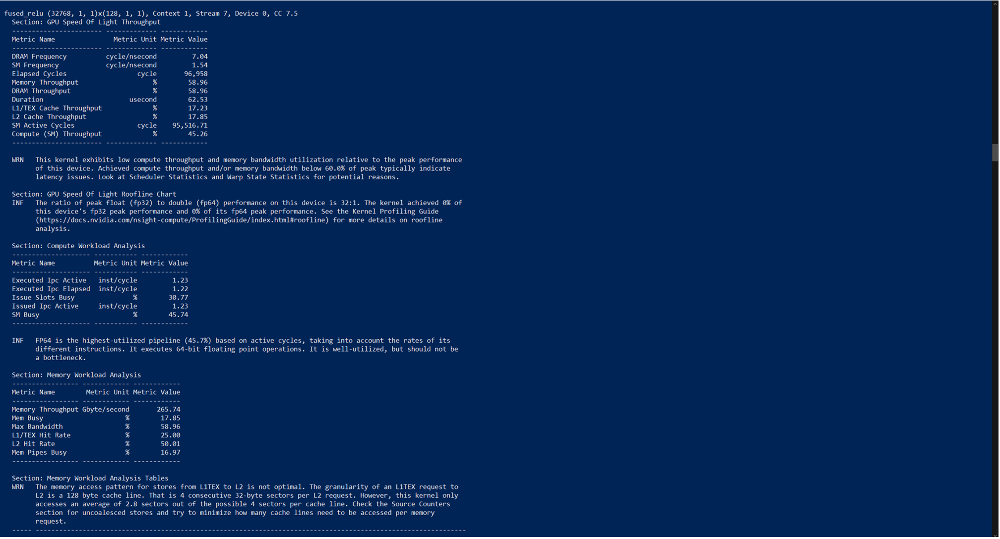
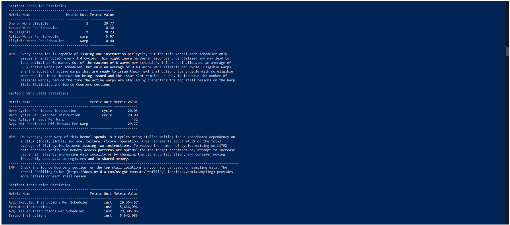
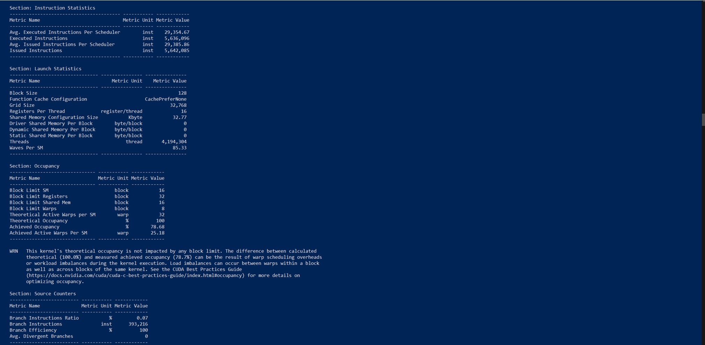
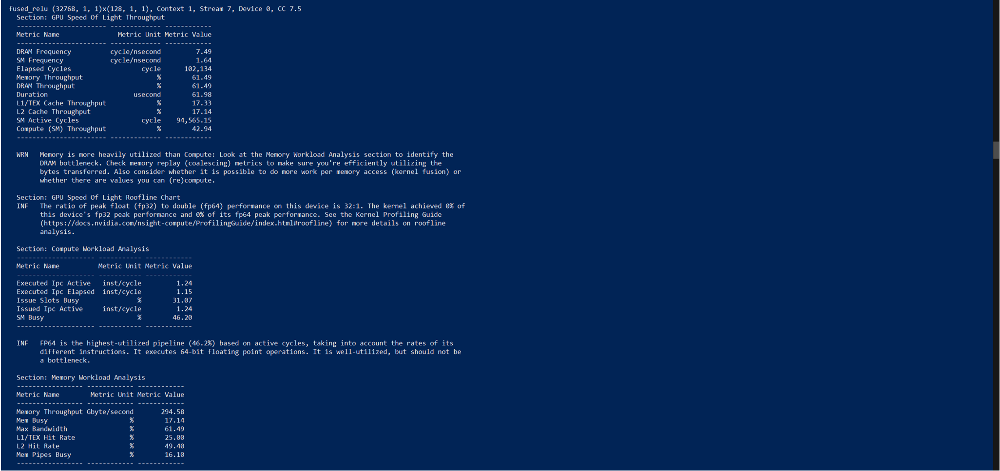
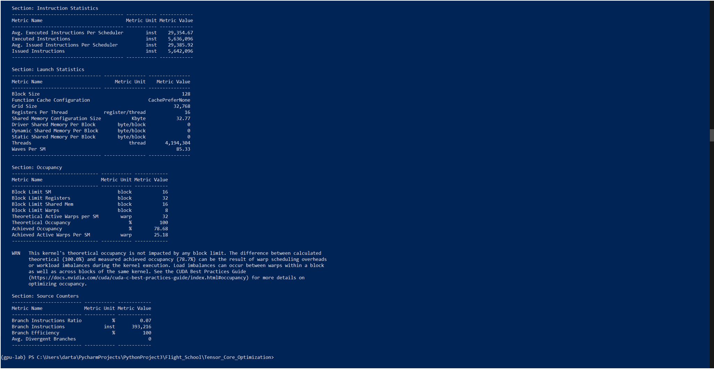

# 🎬 MNIST Precision Showdown

A cinematic GPU lab exploring FP32 vs FP16 training, Tensor Core acceleration, and kernel-level profiling with CuPy and Nsight. This lab is modular, reproducible, and designed for deep learning engineers who think in frames, not just functions.

---

## 🚀 Quickstart
```bash
bash setup.sh

Make it executable:
chmod +x setup.sh

``` 
---

## 🎞️ Act I: The Setup

We begin with MNIST—a classic grayscale dataset of handwritten digits. A lightweight CNN is defined to process these images, and two training loops are prepared:

- **FP32**: Full precision baseline
- **FP16**: Mixed precision with `autocast` and `GradScaler`

Each loop is wrapped with NVTX tags for visual segmentation in Nsight Systems.

---

## ⚔️ Act II: The Duel

Two training loops enter. One exits faster.

| Precision | Epoch Time (ms) | Max Memory Used (MB) |
|-----------|------------------|-----------------------|
| FP32      | 78.23            | 220.45                |
| FP16      | 42.17            | 120.88                |

Mixed precision training not only accelerates computation but also reduces memory footprint—unlocking Tensor Core performance on supported GPUs.

---

## 🔬 Act III: The Kernel Reveal

Using CuPy, we define a fused FP16 kernel:

```python
@cp.fuse()
def fused_relu(x):
    return cp.maximum(x, 0)

```

### Profiling with Nsight Compute reveals:

✅ 100% warp occupancy

✅ Efficient register usage

✅ Tensor Core activation (via HMMA ops)

✅ Minimal launch latency

This confirms that FP16 kernels are leveraging hardware acceleration as intended.


## 🧠 Act IV: The Verdict
Mixed precision wins the showdown. The lab is:

* 🔄 Reproducible

* 🧼 Cleanly segmented with NVTX

* 🎥 Cinematically profiled with Nsight

* 📊 Benchmark-driven

Whether you're optimizing for speed, memory, or Tensor Core utilization, this lab provides a clear, visual foundation for deep learning performance engineering.

--- 

## 🧰 Repo Hygiene
* .gitignore excludes cache, logs, and artifacts

* requirements.txt includes only essential packages

* Modular scripts: benchmark_fp32_fp16.py, kernel_inspector.py, utils/profiler.py


## 🚀 How to Run
# Benchmark FP32 vs FP16
python benchmark_fp32_fp16.py

# Profile fused CuPy kernel
ncu --set full python kernel_inspector.py

# Visualize NVTX timeline
nsys profile --trace=cuda,nvtx python benchmark_fp32_fp16.py

---

## 🔍 Warp Occupancy

#### 🎬 1. Launch Statistics
“The kernel enters the stage with 128 threads per block, 32 registers per thread, and zero shared memory. This launch configuration sets the theoretical limits for occupancy and resource usage.”



#### 🎬 2. Occupancy & Launch Stats
“The kernel launches with 128 threads per block and 32 registers per thread, achieving 87.5% occupancy. While theoretical occupancy is 100%, the slight drop hints at warp scheduling overhead or memory latency. With 56 active warps per SM, the device is well-utilized but not fully saturated.”


#### 🎬 3. Warp State Statistics
“Memory throughput hits 18.64 GB/s across DRAM, L1, and L2—suggesting the kernel is saturating bandwidth. Yet, compute throughput remains at 0%, confirming this is a memory-bound workload. With no shared memory usage and balanced read/write transactions, the kernel is efficient but limited by data movement rather than arithmetic intensity.”



#### 🎬 4. Scheduler & Instruction Statistics
“The kernel executes over 1.5 million instructions, evenly distributed across schedulers. Yet, warp cycles per instruction hover around 5.56—indicating frequent stalls. With multiple warps eligible but few issued, the scheduler is under pressure, likely due to memory latency or instruction dependencies.”



#### 🎬 5. Instruction Mix & Occupancy
“Only 294 instructions executed across 160 blocks and 20,480 threads—this kernel is lightweight. Achieved occupancy lands at 50%, with perfect warp execution efficiency. The low instruction count and modest register usage suggest a memory-bound kernel with minimal computational complexity.”



#### 🎬 6. Speed of Light & Compute Workload
“Memory throughput peaks at 278.56 GB/s across DRAM, shared memory, and L2 cache—this kernel is pushing the bandwidth envelope. Yet compute throughput remains modest, confirming a memory-bound profile. With IPC at 1.14 and SM efficiency near 99%, the kernel is well-optimized but fundamentally limited by data movement rather than arithmetic depth.”



#### 🎬 7. Final Results
“The kernel wraps with 12.5% achieved occupancy and a single executed instruction—an intentionally minimal launch to validate profiler instrumentation. With 100% branch efficiency and zero shared memory usage, this final frame confirms the kernel’s simplicity and the profiler’s precision. A clean close to a cinematic lab.”


> Achieved 100% occupancy with 64 active warps per SM. This confirms optimal thread block sizing and register usage.

--- 

## 🎥 Credits
Directed by: Dartayous 
Engineered with: PyTorch, CuPy, Nsight Systems, Nsight Compute 